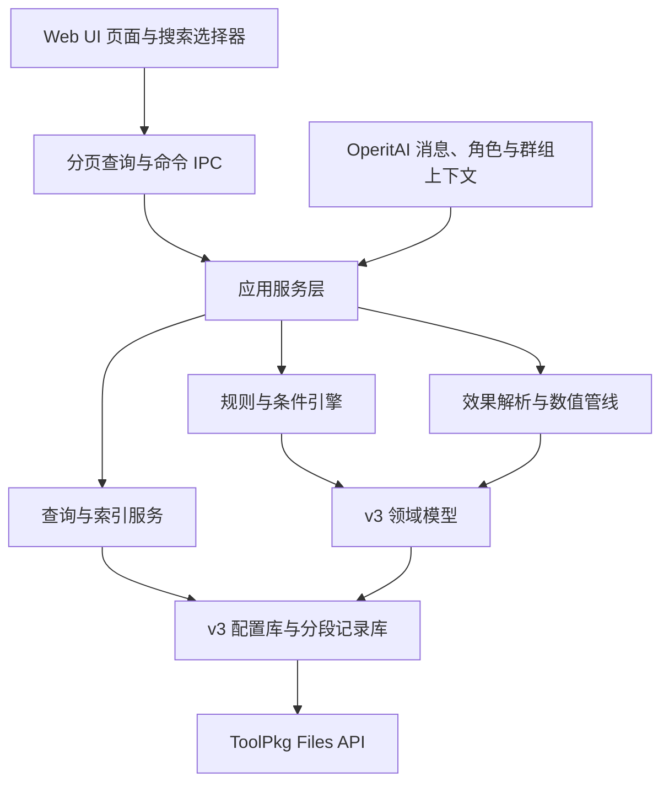

# Operit MVU v3 完整改造设计规格

- 日期：2026-08-25
- 状态：已完成逐节确认，等待规格复核
- 目标实现：插件本地 v3 分层架构
- 发布版本：0.3.0
- 宿主验收：`OperitAI` 文件夹中的修改版 APK

## 1. 背景与目标

当前 v2 已具备字段、自然变化、每轮变化、状态联动、规则、AI 判断和多目标临时效果等能力，但模型、存储和界面仍以小规模数据与单层配置为前提，主要问题包括：

- 临时效果仍是“一个配置直接修改若干目标”，不能准确表达“事件触发者只影响自己”的动态语义。
- 规则只能使用固定条件联合类型，条件不能作为独立资产查看、组合、修改、复制和安全删除。
- 规则缺少独立的触发角色绑定，触发角色与效果目标角色容易混淆。
- 字段、角色、群组、规则和记录数量增加后，界面一次创建过多元素，选择器也缺少统一搜索入口。
- 主数据和记录集中写入单个 JSON，历史记录与去重集合会持续增长。
- 页面底栏、保存按钮和滚动区域依赖绝对定位及预留高度，容易产生遮挡。
- 功能入口在抽屉和底栏中重复，设置层级不稳定。

本次改造以插件本地 v3 架构完成以下目标：

1. 把临时效果升级为可命名、可复用、以组为单位的多字段效果系统。
2. 明确区分规则触发角色、字段目标角色和已激活效果实例。
3. 建立完整条件库，支持条件增删改查、引用管理和 AND/OR/NOT 嵌套表达式。
4. 对字段、角色、群组、规则、条件、效果和记录提供可扩展查询能力。
5. 拆分配置与历史记录存储，提供崩溃恢复、v2 无损迁移和大数据边界。
6. 将插件重组为“状态、配置、规则、高级”四个稳定入口。
7. 统一搜索选择器、紧凑列表、页面切换动画与底部安全布局。

本次不要求修改 OperitAI 宿主业务架构。必要的文件读取能力在插件的 `MvuFileApi` 适配层扩展，并使用现有 ToolPkg Files API；修改版 APK 仅作为真实宿主完成集成验收。

## 2. 总体架构

v3 采用插件内分层设计，界面不直接读写完整数据集：



职责边界：

- 领域模型只表达字段、条件、规则、效果定义和激活实例，不依赖 UI。
- 应用服务负责事务、引用校验、迁移和事件执行。
- 查询服务负责搜索、筛选、排序、计数、分页和选择器游标。
- UI 只保存页面状态与未提交表单，不缓存完整历史数据。
- 文件存储负责原子提交、分段记录、修复和兼容读取。

## 3. 临时效果组与动态角色语义

### 3.1 两层效果模型

临时效果拆成定义和运行实例：

```ts
interface EffectGroupDefinition {
  id: string;
  name: string;
  description: string;
  enabled: boolean;
  fieldEffects: FieldEffectDefinition[];
  defaultDuration?: EffectDuration;
  createdAt: string;
  updatedAt: string;
}

interface ActiveEffectInstance {
  id: string;
  definitionId: string;
  triggerActorId?: string;
  resolvedTargets: ResolvedEffectTarget[];
  duration: EffectDuration;
  remainingTurns?: number;
  activatedAt: string;
  reason: EffectReasonSnapshot;
}
```

- `EffectGroupDefinition` 是用户编辑和规则引用的可复用模板。
- `ActiveEffectInstance` 是一次实际触发，保存当时的触发角色、解析后的目标和原因快照。
- 修改定义不追溯篡改已有记录；是否同步到活跃实例由用户执行显式“更新活跃实例”操作。

### 3.2 字段优先的编辑结构

效果组编辑器先显示字段，再在字段内部设置角色目标与操作：

```ts
interface FieldEffectDefinition {
  id: string;
  fieldId: string;
  actorSelector: EffectActorSelector;
  operations: EffectOperation[];
}

type EffectActorSelector =
  | { kind: "all_bound" }
  | { kind: "trigger_actor" }
  | { kind: "selected"; actorIds: string[] };
```

默认选择 `all_bound`，表示该字段绑定的全部角色；`trigger_actor` 表示仅作用于本次事件的触发角色；`selected` 用于显式选择一个或多个角色。

触发角色不存在、已删除或不具备目标字段时，当前动作被跳过并写入诊断记录，绝不自动扩大成所有角色。

### 3.3 计算操作

一个字段效果可组合多个操作：

- `immediate_delta`：效果激活时立即增加或减少固定值。
- `fixed_adjustment`：符合来源过滤的每次后续变化增加固定修正量。
- `all_multiplier`：对符合来源过滤的后续变化统一乘倍率。
- `positive_multiplier`：仅对大于零的后续变化乘倍率。
- `negative_multiplier`：仅对小于零的后续变化乘倍率。
- `source_filter`：限定自然变化、每轮变化、规则变化或 AI 更新来源。

效果运算顺序固定为：

1. 获取本次基础变化量。
2. 根据来源与正负方向筛选可应用操作。
3. 应用固定修正量。
4. 应用正向或负向倍率。
5. 应用通用倍率。
6. 按字段步长对齐。
7. 按字段自定义最小值和最大值裁剪。

即时变化在激活时单独进入同一套“步长与上下限”收尾流程，不重复套用刚激活效果的后续变化倍率。

### 3.4 T 角色验收语义

单个效果组可以表达：

- 目标字段：A 欲望。
- 目标角色：`trigger_actor`。
- 操作一：`immediate_delta = -30`。
- 操作二：`positive_multiplier = 0.5`。

当 T 角色触发 B 事件时，实例记录 `triggerActorId = T`，只有 T 的 A 欲望立即下降 30，之后符合来源条件的正向增长按 0.5 倍计算；U、V 等其他拥有 A 欲望的角色不受影响。

### 3.5 效果名称与原因

效果组必须设置可修改名称，可选填写说明。原因设置直接放在效果组编辑器的计算配置下方，不建立独立页面：

- 默认模板：提供“规则触发”“自然变化修正”“每轮变化修正”“AI 更新修正”和“手动应用”等模板。
- 自定义原因：在同一位置切换后直接编辑原因文本。
- 模板和自定义文本都可使用触发角色、规则名称、效果组名称、字段名称和当前事件等可视化变量。
- 编辑器实时显示最终原因预览，保存前无需进入其他页面查找。

激活时把解析后的原因写入 `EffectReasonSnapshot`。此后即使模板、规则或效果组改名，旧变化记录仍显示当时的完整原因。

## 4. 规则、触发角色与动作

### 4.1 规则模型

```ts
interface RuleDefinition {
  id: string;
  name: string;
  description: string;
  enabled: boolean;
  triggerActorSelector: RuleActorSelector;
  conditionId: string;
  actions: RuleAction[];
  cooldownHours?: number;
  executionOrder: number;
  createdAt: string;
  updatedAt: string;
}
```

触发角色选择器支持：

- 任意角色。
- 当前消息角色。
- 选择的一个或多个角色。
- 选择的角色群组。

角色过滤发生在条件求值和 AI 请求之前，避免无关角色进入 AI 判断。

### 4.2 动作类型

规则动作至少包括：

1. `change_field`：直接改变一个字段，可设置目标角色、变化值和要应用的活跃效果组。
2. `activate_effect_group`：激活一个效果组，并把当前事件角色写入 `triggerActorId`。

“触发条件”只决定规则是否执行；“触发结果”只描述执行后改变的字段内容或激活的效果组。界面和数据模型不再把条件文本混入效果内容。

## 5. 完整条件库

### 5.1 独立条件实体

```ts
interface ConditionDefinition {
  id: string;
  name: string;
  description: string;
  enabled: boolean;
  expression: ConditionExpression;
  createdAt: string;
  updatedAt: string;
}
```

规则只保存 `conditionId`，条件可以被多个规则复用。条件库提供搜索、筛选、查看、创建、复制、重命名、编辑、启停、删除和引用列表。

编辑共享条件前显示受影响规则；被引用条件不能静默删除，用户必须先替换引用、停用相关规则或明确执行连带处理。

### 5.2 表达式与谓词

```ts
type ConditionExpression =
  | { kind: "and"; children: ConditionExpression[] }
  | { kind: "or"; children: ConditionExpression[] }
  | { kind: "not"; child: ConditionExpression }
  | { kind: "predicate"; predicate: ConditionPredicate };
```

第一版完整谓词库包括：

- 字段比较：等于、不等于、大于、大于等于、小于、小于等于、区间内、区间外。
- 消息统计：指定时间窗内消息数、连续消息数、互动频率。
- 关键词：任一匹配、全部匹配、排除词，可设置大小写与匹配范围。
- 发送者与触发角色：当前角色、指定角色、角色集合、群组。
- 不活跃时长：距上次发言、距上次字段变化或距上次规则触发。
- 日期：具体日期、日期区间、每年重复日期、星期与时间段。
- AI 语义判断：自定义触发类型、触发要求和最低置信度。

系统默认模板以普通 `ConditionDefinition` 写入条件库，可修改和删除；删除后不会在启动时自动重建。“恢复默认条件”只位于高级数据维护页面，并在执行前显示将新增的模板。

多个 AI 谓词在同一消息周期合并成一次结构化模型请求。请求明确携带消息角色与演员标识，不再把当前消息当作无角色字符串。模型失败时只令相应 AI 谓词失败，确定性谓词继续正常求值。

高频互动改用独立的小时统计桶，不依赖有限的消息事实缓存；旧“特别的日子”迁移时保留原关键词语义，用户可在条件编辑器中改为真实日期谓词。

## 6. v3 存储与查询

### 6.1 文件拆分

配置与历史记录分开存储：

```text
operit_mvu.dataset.v3.json
operit_mvu.records.v3/
  segment-000001.jsonl
  segment-000002.jsonl
  ...
```

主数据文件包含字段配置、规则、条件、效果组、活跃实例、索引元数据、当前提交版本和分段清单。历史记录采用 JSON Lines，每段最多 500 条，并记录条数、时间范围和提交版本。

### 6.2 崩溃安全提交

写入顺序：

1. 将记录追加到下一提交版本对应的分段。
2. 刷新分段元数据。
3. 将新主数据写入临时文件。
4. 通过移动替换原子提交主数据。
5. 只有主数据声明的提交版本与行数可见。

启动时若发现分段尾部超出已提交行数，将其识别为孤立尾部并修复；不会把未提交记录暴露给查询。

### 6.3 有界运行缓存

- `processedMessageIds` 使用最多 2048 项的环形集合。
- 最近消息事实默认保留 50 条，仅用于短期上下文。
- 高频统计使用独立小时桶，并按保留策略合并或清理。
- 历史记录不进入完整快照，只通过查询接口读取。

### 6.4 查询接口

IPC 提供独立查询命令：

- `queryFields`
- `queryActors`
- `queryGroups`
- `queryRules`
- `queryConditions`
- `queryEffectGroups`
- `queryRecords`
- `getEntityById`

查询参数包含关键词、筛选条件、排序、页码或游标。响应统一包含 `items`、`loadedCount`、`totalCount`、`hasMore` 和稳定排序游标。

管理页面分页标准：

- 规则列表每页 5 条。
- 字段列表每页 5 条。
- 变化记录每页 10 条。
- 条件库和效果组每页 10 条。

主快照只返回当前页面所需摘要、首屏数据和总数，禁止把所有历史记录或所有可选实体塞入页面快照。

### 6.5 AI 字段预算

字段很多时，模型输入只包括：

1. 当前规则和条件直接引用的字段。
2. 用户标记为 AI 高优先级可见的字段。
3. 在剩余预算内按最近变化排序补充的字段。

页面显示“本轮使用 X / 共 Y 个字段”，保证被规则直接引用的字段不会因预算被截断。

## 7. 搜索、选择器与大量数据界面

### 7.1 统一搜索选择框

字段、角色和群组不使用页面内“加载更多”。点击选择控件后打开统一选择框，提供：

- 关键词搜索。
- 作用域、类型、启用状态等上下文筛选。
- 单选或多选模式。
- 已选项目置顶。
- “匹配 X / 共 Y 条”结果提示。
- 空结果、加载失败和重试状态。

选择框内部使用虚拟滚动和后台游标按需读取，滚动时自动获取下一批结果，不向用户显示“加载更多”按钮，也不一次创建全部 DOM。

所有可能出现大量字段的入口必须使用该选择框，包括：

- 规则条件中的字段。
- 规则触发结果。
- 临时效果组字段。
- 状态联动源字段与目标字段。
- 自然变化、每轮变化和 AI 自动更新。
- 字段的角色或群组绑定。
- 数据导入时的字段映射。

### 7.2 管理列表

字段列表每页 5 条，每项提供明确的“查看”和“修改”操作，并显示名称、作用域、绑定对象、当前值、上下限和启用状态摘要。

规则列表每页 5 条，使用紧凑行式摘要，不缩小字体。默认只展示名称、启用状态、绑定角色、条件摘要和效果摘要；点击整行进入详情，行尾保留必要的启停与更多操作。

页面显示“本页 1–5 / 共 X 条”或“匹配 X / 共 Y 条”。搜索、筛选和排序先在查询层执行，UI 只渲染当前结果。

### 7.3 字段作用域

字段作用域保持四类，但使用面向用户的名称与说明：

- **角色（独立）**：每个选中角色拥有互不影响的数值。
- **群组（共享）**：群组内角色共同读取和修改同一个数值。
- **全局**：所有角色和会话共享，适合世界状态与公共进度。
- **当前会话**：只在当前打开的会话中生效，切换会话后读取对应会话的数据。

角色和群组均通过同一搜索选择框绑定，显示名称与头像，内部 ID 只作为次要诊断信息。群组绑定不能再只显示 UUID 或单个固定群组。

选择“当前会话”时默认自动绑定正在打开的会话，并显示用户可辨认的会话标题；高级绑定管理默认收起。只有用户展开高级管理时，才可关闭自动绑定、选择其他会话，或创建暂不生效的字段模板。

编辑字段中的“作用域、图标、主题色、详细配置”采用与“基础信息”一致的区块标题、间距和对齐规则；详细配置使用紧凑摘要行，不把图标、标题和说明挤在不同基线上。

## 8. 信息架构与导航

底栏固定为四个一级入口：

1. **状态**：角色状态、群组状态、状态详情和变化记录。
2. **配置**：字段设置、自然变化、每轮变化和状态联动。
3. **规则**：规则总体设置、完整条件库和临时效果组。
4. **高级**：导入导出、外观、v2/v3 迁移、默认条件恢复和诊断。

抽屉使用同一套四区信息架构，不再创建另一套“配置/外观”分类。外观功能从抽屉独立分区移除，归入高级页面。

导航规则：

- 四个一级根页面左上角使用三道杠菜单图标。
- 二级和编辑页面使用纯箭头图标，不加带色按钮底板。
- 返回行为优先使用页面历史；直接深链进入时返回所属一级入口。
- 角色状态与群组状态使用同级标签，群组页提供与角色相同的群组选择区，支持多个群组切换。

## 9. 布局与动效

页面采用正常流或 Grid 布局：页头、滚动内容、上下文操作区、底栏依次排列。底部保存按钮和底栏不使用 `position: absolute` 叠放，也不依赖猜测式底部内边距。

字段详情页使用统一的 `12px` 垂直卡片间距，数值、阶段、趋势、最近变化和状态说明之间遵循同一节奏。阶段与趋势之间不得使用负边距、边框贴合或单独压缩间距；页面密度通过卡片内部留白与摘要布局优化，不能牺牲卡片之间的层次。

统一修复以下问题：

- 字段详情保存按钮遮挡趋势图、最近变化或状态说明。
- 每轮变化标签与字段卡片重叠。
- 同类分段控件高度过大。
- 标题、图标、主题色和详细配置的对齐与层级不一致。

不缩小现有正文字号，通过减少无效留白、压缩卡片内边距和改用紧凑摘要降低页面高度。

标签和页面切换使用短促的位移与淡入动效；启用系统“减少动态效果”时关闭非必要动画。趋势图同一天显示具体时间，跨天才显示日期，避免重复日期标签。

阶段条与趋势图必须共享同一套数值坐标：趋势纵轴固定使用字段自定义最小值和最大值，不再按近期样本单独缩放；阶段阈值以轻量分区或参考线映射到趋势背景，并复用阶段配色。相同字段值在阶段条和趋势图中的相对位置必须一致，例如 `0–100` 字段的 `48` 在两处都位于 48% 高度。为保持小幅变化可读，可增强折线点、标签和当前值提示，但不能改变纵轴比例。

## 10. v2 到 v3 迁移

迁移过程不覆盖 `operit_mvu.dataset.v2.json`：

1. 读取并校验 v2。
2. 在新路径构建 v3 主数据与记录分段。
3. 迁移字段、作用域绑定、自然变化、每轮变化、状态联动和 AI 配置。
4. 将旧规则条件映射为条件定义和谓词，并让规则引用生成的 `conditionId`。
5. 将旧规则字段结果迁移为 `change_field` 动作。
6. 将旧临时效果目标迁移为效果组字段项和操作；保留已有多目标、原因、启用状态与规则引用。
7. 为旧启用效果创建等价活跃实例，精确保留原字段、作用域和作用域键，不扩大目标。
8. 校验实体数量、引用完整性、记录数量和关键值。
9. 校验通过后才把运行版本切换到 v3。

迁移失败时继续以 v2 兼容模式运行，显示错误、重试和导出入口。v3 导入导出包含主数据及分段记录，同时继续接受 v2 备份导入。

## 11. 异常与引用处理

- 缺失触发角色：跳过当前动作并记录诊断，不广播。
- 缺失字段或角色：保留配置并标记“需要修复”，提供重新绑定入口。
- 删除被引用条件或效果组：阻止静默删除，要求替换、停用或确认连带处理。
- AI 请求失败：仅 AI 谓词失败，确定性条件不受影响。
- 分段损坏：隔离损坏段并报告可恢复范围，主数据不被覆盖。
- 搜索查询失败：保留已选项和用户输入，允许重试。
- 并发保存：使用修订号检测冲突，拒绝后写覆盖，并提供重新载入与对比提示。

## 12. 测试与验收

实现采用测试驱动方式，每项行为先增加失败测试，再实现最小改动并重构。

### 12.1 自动测试

- 效果运算：来源过滤、即时变化、固定修正、正负倍率、通用倍率、步长和上下限顺序。
- 动态演员：T 触发 B 后仅 T 的 A 字段 `-30` 且正向倍率 `0.5`，U/V 不变。
- 条件表达式：AND、OR、NOT、嵌套、角色预过滤、AI 批处理和失败隔离。
- 引用完整性：共享条件编辑、替换引用、删除阻止和缺失目标修复。
- 迁移：旧字段、规则、条件、临时效果、记录和失败回退。
- 存储：原子提交、孤立尾部、分段轮换、重启恢复和并发修订冲突。
- 查询：搜索、筛选、稳定排序、分页无重复无遗漏、结果计数。
- UI 审计：规则 5 条、字段 5 条、记录 10 条；选择器无“加载更多”；大量字段入口均可搜索；当前 DOM 不超过必要窗口。

压力夹具至少包含：500 个字段、200 个角色与群组、1000 条规则、10 万条记录。

### 12.2 视觉验收

在 320、360、393、430 像素宽度以及 100%/130% 字体缩放下检查：

- 四入口底栏和页面跳转正确。
- 一级菜单与二级返回图标符合规则。
- 保存区、底栏、标签、趋势图和字段卡片没有重叠。
- 字段详情卡片之间保持统一 12px 间距，阶段与趋势之间不再出现贴合或异常压缩。
- 阶段条与趋势图使用相同的字段范围、阈值和配色，相同数值的相对位置一致。
- 规则与字段列表保持正常字号且信息可辨认。
- 搜索选择框能够显示已选项、匹配数量和空状态。
- 页面与标签切换平滑，并遵循减少动态效果设置。

### 12.3 OperitAI 集成验收

完成插件构建后，使用 `OperitAI` 文件夹中的修改版 APK 进行真实宿主测试：

1. 创建并切换至少两个群组，群组选择和状态均正确。
2. 创建、复制、编辑、启停和删除无引用条件；验证被引用条件保护。
3. 创建绑定角色的规则并验证角色过滤在 AI 请求前发生。
4. 用一个效果组完成 T/A/B 场景，重启后状态和剩余时长保持一致。
5. 导入大量字段，验证所有相关入口都使用搜索选择框。
6. 验证规则、字段和记录分页数量及统计提示。
7. 验证 v2 迁移、v3 导出、重新导入与失败恢复。
8. 验证消息触发、记录写入、插件重启和 APK 重启后的持久化。

## 13. 完成标准

只有同时满足以下条件才视为完成：

- 所有新增及既有自动检查通过。
- v2 数据迁移无静默丢失并具备回退路径。
- T 角色动态效果场景严格通过。
- 完整条件库可以通过 UI 增删改查并安全管理引用。
- 所有可能大量出现字段的入口均可搜索，页面不一次渲染全部数据。
- 四区导航、紧凑列表和底部布局通过目标尺寸视觉验收。
- 修改版 OperitAI APK 中的真实消息、角色、群组与持久化流程通过。
